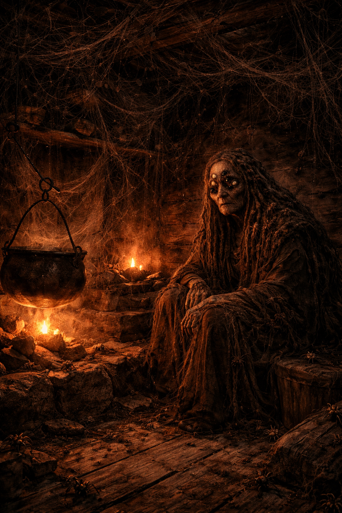
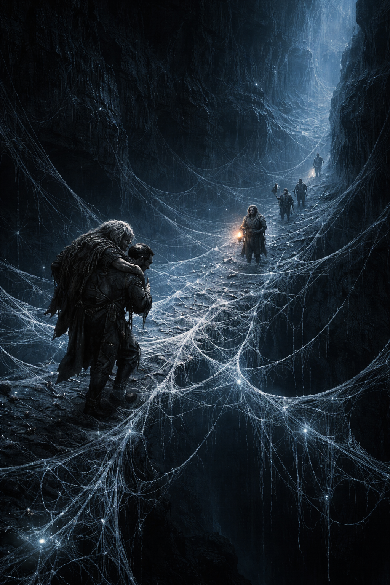

## Echoes of the Mountain – Part I-A: The Mother of Spiders

### 🎙️ Read-Aloud (Approaching the Cliffside Cabin)

Read slowly, eerie but not immediately threatening.

> Following the trail Nokomis’ messenger indicated, you move deeper into the forest.
>
> The snow grows heavier here, clinging to the needles of ancient pines. The wind drops away, replaced by a strange, muffled silence.
>
> Ahead, the path dips toward a cliffside, where a small dugout cabin is built directly into the rock face. Smoke trickles weakly from a crooked chimney.
> The structure looks old, weathered, half-swallowed by the mountain itself.
>
> As you approach, a faint chittering sound drifts from inside… like hundreds of tiny claws skittering across wood.
>
> The door stands slightly open.
>
> Inside, a dim orange glow pulses like a dying ember.

---

### 🎙️ Read-Aloud (Inside the Cabin)

Use a soft, unsettling tone.

> The air inside is warm but thick, almost sticky. A small fire burns at the back of the one-room shelter — just enough to cast quivering shadows on the walls.
>
> An old woman moves slowly around the room, her back hunched, her steps dragging softly across the wooden floor. Her hair hangs long and tangled, matted into thick ropes.
>
> Then you notice movement within it.
>
> Spiders.
>
> Dozens — maybe hundreds — nest in her hair, crawl along her shoulders, slip beneath the fabric of her tattered shawl. The walls themselves ripple with them, covering every inch in shifting black patterns.
>
> They cling to the ceiling. The bedposts. The hearth. Her.
>
> The woman does not seem to notice them.
>
> She turns to you with uneven, glassy eyes — one milky white, the other reflecting the firelight like an insect’s lens.
>
> “Oh…” she whispers, voice thin and layered, as though more than one throat speaks.
>
> “You’ve come back… have you?”

---

### 📌 DM Reference — Who She Is

- **Name**: Aani of the Web
- **Race**: Skinwalker (Spider-Totem), spiritually maimed
- **State**: Traumatized, soul partially detached, amnesiac
- **Alignment**: Neutral / Good (confused)

**Backstory Summary**

- **Captured Skinwalker**: Aani was a skinwalker captured and taken to the mine.
- **Interrupted Ritual**: The sorcerer began the ritual to rip out her soul to absorb the magic of the spider totem.
- **Half-Torn Soul**: The attack on the wagons interrupted the ritual mid-process.
- **Broken Escape**: Her soul was half-torn, leaving her unable to shapechange and barely tethered to her body.
- **Guided by Spiders**: She escaped blindly into the wilderness, guided only by her spider-kin.
- **Mother of Spiders**: The spiders built their home around her; she became their mother, their anchor.
- **Clarity & Fear**: She remembers nothing clearly, but she feels the evil in the mountain with perfect clarity.
- **Encounter Role**: She is not hostile unless frightened; intended as a roleplay-heavy encounter with eerie atmosphere and strong foreshadowing.

---

### 🧠 How Aani Behaves

- **Fragmented Speech**: Her speech is fragmented, often metaphorical.
- **Distant Attention**: She drifts mid-sentence, staring at corners as if listening to unseen voices.
- **Spider-Touch**: She may gently brush spiders off players’ shoulders — whether or not they are actually there.
- **Lucid Moments**: If comforted, she becomes lucid for brief flashes.
- **Defensive Swarms**: If threatened, the spiders become defensive, forming swarms — she herself will never intentionally attack.

---

### 🕷️ Aani of the Web — Stat Block

*Medium humanoid (spider-totem skinwalker), neutral good*

| AC | HP | Speed |
|---|---|---|
| 10 | 10 | 20 ft. |

| STR | DEX | CON | INT | WIS | CHA |
|---|---|---|---|---|---|
| 6 (-2) | 12 (+1) | 6 (-2) | 10 (+0) | 16 (+3) | 12 (+1) |

**Saving Throws:** Wis +5  
**Skills:** Insight +5, Perception +5  
**Senses:** Tremorsense 10 ft. (through spider-kin contact only), Passive Perception 15  
**Languages:** Common (rarely speaks coherently)  
**CR:** 0 (10 XP)

---

**Fractured Soul.** Aani's soul is partially detached from her body. She has disadvantage on all Constitution saving throws. Any creature that succeeds on a DC 13 Arcana check while near her senses something coiled inside — patient, concentrated, furious. This is the potential of the Widow's Molar.

**Spider Kin.** Aani is surrounded by spider-kin at all times. Any creature that enters within 5 feet of her for the first time on a turn must succeed on a **DC 12 Dexterity saving throw** or have 1d4 small spiders crawl on them. A creature that fails must then make a **DC 10 Wisdom saving throw** or be frightened of Aani until the end of its next turn.

**Totem Remnant.** Aani retains a faint trace of her spider totem. She can feel vibrations through any surface she is in contact with, and she is aware of the location of any creature touching the same floor or web within 10 feet of her.

---

**Actions**

**Spider Call (1/Day).** Aani whispers to her kin. A Swarm of Spiders (see *Monster Manual*) forms within 10 feet of her and acts on initiative count 20, acting on instinct to protect her. It does not follow commands.

**Bite (only in extremis).** Aani will not willingly use this action. If she is at 3 HP or below and is still being directly assaulted, her totem instinct surfaces. *Melee weapon attack:* +3 to hit, reach 5 ft., one creature. *Hit:* 1d4+1 piercing damage, and the target must succeed on a **DC 11 Constitution saving throw** or take 1d6 poison damage (half on a successful save).

---

**Reactions**

**Spider Shield.** When Aani takes damage, her spider-kin instinctively cluster around her. She gains 4 temporary hit points, which disappear after 1 minute. She can use this reaction once per short rest.

---

**DM Note:** Aani's HP represents her spiritual health, not combat endurance — track it using the table in the Aani's Spiritual Health section. She will not use her Bite under any normal circumstances. If she reaches 0 HP her soul fractures further; she does not die, but nothing remains behind her eyes.

---

### 🕷️ Information She Can Reveal (if prompted gently)

#### 1. About the Mine

Fragments of memories surface:

- “The stone… screams.”
- “He peels the spirit like silk… strand by strand…”
- “They don’t die in there. They… unravel.”

She cannot give full explanations — only broken truths.

#### 2. About the Sorcerer

She remembers his face only in nightmares.

- “His eyes… oh, his eyes… not man, not beast…”
- “He wants the strong spirits… the walking ones… the ones between forms…”
- “He tried to pull me away… my skin… my shape… my soul…”

Aani is the first proof that the sorcerer is not merely enslaving skinwalkers — he is harvesting them.

#### 3. The Ritual

She may touch a player’s cheek, whispering:

- “Your soul is bright… bright threads… don’t let him see you.”

Aani can show faint psychic echoes:

- a ritual circle  
- the feeling of your spirit being peeled away  
- the shape of antlers in firelight  
- a voice saying “More… bring me more…”

#### 4. Guidance Toward Nokomis

She may deliver this line with absolute clarity:

- “The owl-man waits for you.  
  His camp breathes behind the trees.  
  Go.  
  Before the mountain sees you.”

This is her one moment of calm.

---

### 🧵 Optional Roleplay Challenges

You may use any of the following to deepen the encounter:

#### 1. Aani’s Memory Test

If players show patience, empathy, or curiosity, she becomes clearer and may:

- grant them a hint about the sealed door  
- warn of a “bridge of heat and bone” (the magma chasm)  
- give them a small woven charm made of webbing (advantage vs. fear)

#### 2. Spider Behavior

Spiders respond to the emotional tone:

- **Calm** → spiders remain still  
- **Hostility** → walls ripple  
- **Loud noises** → swarms drop from the ceiling  
- **Healing offered** → spiders cluster protectively around Aani  

#### 3. Aani’s Panic

If players rush her, she recoils and the spiders form a trembling shield.

- She cries, “No more! No more peeling!”
- This should convey suffering, not enemy intent.

---

### 🕳️ The Door in the Floor

After the party has spent time with Aani — through patience, empathy, or simply staying quiet long enough — she crosses slowly to the far corner of the room. She kneels, pulls aside a moth-eaten rug, and reveals a small trapdoor set flush in the floorboards.

**Read-Aloud (Discovering the Door):**

> Aani moves to the far corner, spiders parting around her feet like a slow tide.
>
> She kneels — painfully — and drags back a ragged, moth-eaten rug.
>
> Beneath it: a small trapdoor, barely large enough for a person, set flush in the floorboards. Its iron ring is threaded with silk. A faint current of air rises through the seams, carrying the smell of wet stone and something very old.
>
> She presses her hand flat against the wood and looks up at you.
>
> "She is down there," Aani murmurs. "My eldest. My heart."
>
> Her milky eye drifts toward the door.
>
> "She has been waiting so long. I… I cannot walk so far alone."
>
> A long pause. Then, with quiet urgency:
>
> "Carry me to her. And she will know your names."

---

### 📌 DM Reference — Aani’s Request

- **The Task**: The party must physically carry Aani through the tunnel to her eldest daughter’s chamber.
- **The Reward**: The Elder Weaver blesses each party member who saw Aani safely through.
- **Carrying Aani**: She is almost weightless — a single PC with STR 8 or higher can carry her without speed penalty. She does not fight, struggle, or direct; she simply holds on.
- **Spider Recognition**: Aani’s spider-kin recognize her scent. Creatures in the tunnels that are her kin will not attack a PC who is visibly carrying her. This does not apply to territorial cave creatures that are not her kin.

---

#### 🩸 Aani’s Spiritual Health

Aani’s soul is half-torn. She is not robust — she is held together by habit and spider-silk. Track her HP openly or secretly at your discretion.

**Max HP: 10**

| HP | State | Effect |
|---|---|---|
| 7–10 | **Steady** | Calm, trusting. Will guide navigation if asked — points unerringly toward the correct path. |
| 4–6 | **Distressed** | Whimpering, eyes unfocused, gripping her carrier tightly. No longer guides navigation; spider-kin grow visibly agitated around her. |
| 1–3 | **Catatonic** | Eyes close. She goes completely limp and unresponsive. The Elder Weaver will receive them in silence — no boons are given. |
| 0 | **Soul Break** | Her spiritual tether fractures further. She does not die, but her presence collapses inward — body only, nothing behind the eyes. The Elder Weaver grieves openly. No boons; the party must find their own way out. |

**Damage Sources:**

| Source | Damage |
|---|---|
| Dropped during shaft descent (carrier fails Dex save) | 1d4 |
| Falling through the web crossing | 1d4 |
| Enemy attack (reaches her in combat) | By creature stat block |
| Carrier falls and drops her (any encounter) | 1d4 |
| Rough handling — rushing, shoving, dropped carelessly | 1 |

**DM Note:** With 10 HP, the party can absorb one or two mistakes without losing the boons entirely — but not three. Each mishap should feel meaningful, not arbitrary.

---

### 🗺️ The Tunnel System — DM Overview

The trapdoor opens onto a vertical shaft with knotted silk ropes descending into darkness. The tunnel network below is ancient — carved partly by water, partly by something deliberate. The walls are too smooth in places, as if shaped by intent.

**Structure (in order):**

1. **The Shaft** — Descent by silk rope (skill challenge)
2. **The Web Crossing** — A cavern split by a chasm, bridged by woven silk (skill challenge)
3. **The Blind Passage** — A low, lightless tunnel with territorial cave creatures (combat)
4. **The Weaving Hall** — A vast underground chamber with branching paths (navigation)
5. **The Elder Weaver’s Chamber** — Final destination

Give the tunnels a sacred, lived-in feel: silk hangings catch faint bioluminescent light, cocoons of unknown origin cluster in corners, and the distant sound of something very large moving in the deep carries through the stone.

---

### 🔊 Sound
[Underground cave ambience — start when the trapdoor opens](https://www.youtube.com/watch?v=-8U4tTlG5n4)

---

### ⛰️ Encounter 1 — The Shaft *(Skill Challenge)*

**Description:** A vertical drop of roughly 30 feet, hung with thick silk ropes knotted at intervals. The ropes are old but hold — mostly. The lower section is wet and the footing unreliable.

**Read-Aloud:**

> The trapdoor opens onto darkness. A breath of cold, damp air rises from below.
>
> Silk ropes hang from iron spikes driven into the shaft walls — dozens of them, knotted at intervals. Below, barely visible in the dim light, a stone floor glistens with moisture.
>
> The bottom ropes look dark. Wet.

**Skill Checks:**

| Situation | Check | DC | On Failure |
|---|---|---|---|
| Climbing down unencumbered | Athletics | 10 | Slide — Dex save DC 12 or fall the last 10 ft (1d6 bludgeoning) |
| Climbing while carrying Aani | Athletics | 14 | Slide — same Dex save; on failure, Aani takes 1d4 damage from impact |
| Catching a falling companion | Athletics (reaction) | 13 | Companion falls; if they were carrying Aani, she is dropped |

**DM Note:** A PC who inspects the ropes before descending (Perception DC 12) spots the wet fraying in time to test each one before trusting their weight — they descend with advantage.

---

### 🕸️ Encounter 2 — The Web Crossing *(Skill Challenge)*

**Description:** The first tunnel opens abruptly into a wide underground cavern. The floor has collapsed into a black drop. Spanning it is a lattice of thick spider silk — cords as wide as rope, woven into a rough living bridge still anchored to the far wall.

**Read-Aloud:**

> The tunnel ends at the edge of a black drop. The chasm is wide — far too wide to jump.
>
> Between the walls, something stretches: a web. Not the delicate lace of a garden spider — thick cords of silk, rope-width, woven into a rough lattice. It sways faintly in air rising from below.
>
> It holds. Probably.

**Skill Checks:**

| Situation | Check | DC | On Failure |
|---|---|---|---|
| Crossing unencumbered | Acrobatics | 12 | Foot plunges through a gap; Athletics DC 12 to catch yourself, or become restrained until freed |
| Crossing while carrying Aani | Acrobatics | 16 | As above; Aani’s weight shifts unpredictably. On fall: silk catches her but she is badly shaken — she whimpers "No more…" and goes limp. She is unharmed but distressed. Further rough handling now causes catatonia. |
| Cutting a path | Automatic | — | Each strand cut causes 1d4 spiders to swarm the cutting PC as a warning — not damaging, just deeply unpleasant |
| Scouting a sturdier route | Perception DC 13 | — | Advantage on the crossing check |

**DM Note:** A PC who moves slowly and tests each strand before stepping (costs double movement per square) gets automatic advantage. Narrate the silk creaking and swaying underfoot.

---

### 🪱 Encounter 3 — The Blind Passage *(Combat)*

**Description:** The passage tightens sharply — ceiling drops, walls close in. The tunnel must be crawled through for roughly 40 feet. It is total darkness unless the party has a light source. The ceiling is blanketed in thousands of pale silk worms, hanging in dense clusters on threads they have secreted. They are blind, but they feel vibration — and warmth. They are not Aani’s kin and will drop without warning.

**Read-Aloud:**

> The tunnel tightens. You must duck, then crouch, then get on your hands and knees.
>
> The walls are damp. Close. Your torchlight barely reaches three feet.
>
> When you raise it — you see the ceiling.
>
> It moves.
>
> Thousands of pale, finger-length worms hang suspended in their own silk, swaying gently in the air your movement has disturbed.
>
> Then the first one lets go.

---

**Silk Worm — Stat Block**

*Small beast, unaligned*

| | |
|---|---|
| **AC** | 10 |
| **HP** | 4 (1d6 + 1) |
| **Speed** | 15 ft., climb 15 ft. |

| STR | DEX | CON | INT | WIS | CHA |
|---|---|---|---|---|---|
| 6 (−2) | 10 (+0) | 12 (+1) | 1 (−5) | 6 (−2) | 1 (−5) |

**Blindsight** 30 ft. (blind beyond this radius) — senses only heat and vibration.

**Actions:**

- **Drop (first round only):** Each worm in range of a heat source drops from the ceiling when the party enters. Each PC must make a **DC 12 Dexterity saving throw** or have a worm latch onto them (see Acid Latch below). On a success, the worm lands harmlessly and must move to attack on its next turn.

- **Bite:** *Melee weapon attack.* +2 to hit, reach 5 ft., one creature. *Hit:* 1 piercing damage, and the worm latches (see Acid Latch).

**Acid Latch (special):**

When a silk worm latches onto a creature, it begins secreting a thin stream of caustic fluid. At the **start of each of the host’s turns**, the latched worm deals **1d4 acid damage** automatically — no attack roll required.

- A creature can rip a latched worm free with a **DC 12 Strength check** (costs their action).
- An adjacent ally can remove it for them (also costs their action).
- A latched worm has AC 10 and 4 HP but has **total cover** while attached. Attacks that miss may hit the host instead (DM discretion).
- A worm that is removed or killed leaves a **burning welt** — the host has disadvantage on Concentration checks until a short rest.

---

**Setup:**

- **Enemies**: 1 silk worm per PC (they drop simultaneously when the party enters). Add 1–2 extras for larger or more experienced groups.
- **Terrain**: The passage fits only one or two PCs abreast. PCs at the back have no melee targets — but are still in drop range.
- **Aani’s Position**: She must be set down or braced against the wall before combat — a PC cannot fight while carrying her. Setting her down costs a bonus action.

**Key Rules:**

- A PC still carrying Aani when combat starts fights with disadvantage on all attack rolls.
- Aani, when set down, whispers — small spiders form a loose protective ring. Any worm crawling toward her must spend its full movement to cross the ring (one round of delay per crossing attempt).
- If a worm reaches Aani and latches, she takes 1d4 acid damage per turn as normal. Track her HP — she becomes catatonic at 3 HP or below.

**DM Note:** The real pressure here is action economy. Every PC who uses their action to remove a worm from themselves or a friend is not killing worms — and latched worms keep dealing damage. Push the players into hard, fast decisions. Prioritize narrating the acid damage viscerally: *"the fluid burns through your sleeve and into skin."*

---

### 🧭 Encounter 4 — The Weaving Hall *(Navigation)*

**Description:** The narrow passage opens into a vast underground cathedral. Thousands of silk threads hang from a ceiling lost in darkness, forming near-walls of fiber, each slightly luminescent. At least five passages lead deeper, half-hidden behind curtains of web. The wrong paths dead-end — one notably gruesome.

**Read-Aloud:**

> The passage opens, and the ceiling disappears into dark.
>
> You stand at the edge of an enormous underground hall. Thousands of silk threads descend from above, some thick as rope, others barely visible — a forest of pale silver fiber swaying in unseen air currents.
>
> Five passages lead forward, each half-swallowed by hanging web.
>
> There is no obvious path.

**Navigation Options:**

| Method | Check | DC | Result |
|---|---|---|---|
| Ask Aani (if unharmed and calm) | None | — | She points unerringly toward the correct passage without words |
| Follow the spiders | Perception | 11 | Small spiders drift in one direction; the air from that passage is faintly warmer |
| Read the threads | Arcana or Nature | 14 | One cluster of threads vibrates rhythmically — like a signal, or a heartbeat |
| Guess | None | — | 1-in-5 chance of the correct path; wrong paths loop back after 10 minutes of travel |

**Wrong Path Hazard:**

One path leads to a massive sealed cocoon — horse-sized, hanging from the ceiling. As the party approaches, it splits open. Inside: not a living creature, but the dissolved remains of a traveler who wandered in alone. Armor. Boots. A corroded blade. A warning, not a fight.

**DM Note:** If Aani is unharmed, this encounter is trivially easy — she simply points. This is intentional. Protecting her is the skill test. Her clarity here is her thank-you.

---

### 🕷️ The Elder Weaver’s Chamber

**Read-Aloud (Arrival):**

Read this slowly. Let it breathe.

> The last web parts like a curtain, and you step into warmth.
>
> The chamber is enormous — a cathedral of stone and silk. Bioluminescent fungi trace the walls in veins of faint blue and amber, casting soft wavering light across a floor of smooth stone and fine-spun silk.
>
> At the center hangs the Elder Weaver.
>
> She is large. Very large — the body of a horse, suspended in a web that spans the full width of the chamber. Her legs move with slow deliberateness, tending threads that lead in every direction. Her eyes — all eight of them — catch the fungal light.
>
> She does not look at you.
>
> She looks past you.
>
> To the figure you carry.
>
> Something shifts in the room. The air changes. The silk sings — a low, resonant chord felt more in the chest than heard in the ears.
>
> She reaches one long limb toward Aani, and speaks. The voice seems to come from the walls themselves, layered and deep:
>
> "Mother. You came."

---

### 📌 DM Reference — The Elder Weaver

- **Demeanor**: Ancient, unhurried, deeply perceptive. She already knows who the party is and what they did in the tunnels.
- **Speech**: She speaks in layered tones — the party hears one voice but *feels* a secondary vibration beneath it, like a chord under a melody.
- **If Aani arrived unharmed**: The Elder Weaver tends to her mother first — a quiet, unhurried moment. Then she turns to the party. Allow this reunion to breathe. This is a family scene, not a monster scene.
- **If Aani was hurt or went catatonic**: The Elder Weaver receives them in silence. She tends to Aani with great care. She does not acknowledge the party. They receive no boons and must find their own way out.

**DM Note:** Do not rush the reunion. Give each player a moment to observe something — the way Aani’s shoulders finally relax, the way the spiders from her hair drift gently to the Elder Weaver’s silk, the way the old woman’s breathing slows for the first time.

---

---

### 🕷️ The Elder Weaver — Stat Block

*Huge beast (ancient spider), neutral good*

| AC | HP | Speed |
|---|---|---|
| 15 (natural armor) | 114 (12d12+48) | 30 ft., climb 40 ft. |

| STR | DEX | CON | INT | WIS | CHA |
|---|---|---|---|---|---|
| 20 (+5) | 16 (+3) | 18 (+4) | 14 (+2) | 18 (+4) | 16 (+3) |

**Saving Throws:** Dex +7, Con +8, Wis +8, Cha +7  
**Skills:** Insight +8, Perception +8, Stealth +7  
**Damage Resistances:** Poison  
**Condition Immunities:** Poisoned  
**Senses:** Blindsight 60 ft., Tremorsense 120 ft. (while in contact with web), Darkvision 60 ft., Passive Perception 18  
**Languages:** Understands all languages; communicates through layered vibration felt in the chest rather than heard - all creatures within 60 ft. can understand her  
**CR:** 6 (2,300 XP)

---

**Spider Climb.** The Elder Weaver can climb difficult surfaces, including ceilings, without requiring an ability check.

**Web Sense.** While in contact with a web, the Elder Weaver knows the exact location of any creature also in contact with that web.

**Web Walker.** The Elder Weaver ignores movement restrictions caused by webbing.

**Ancient Presence.** The first time a creature attacks the Elder Weaver without having been attacked by her first, it must succeed on a **DC 16 Wisdom saving throw** or be frightened of her until the end of its next turn.

**Paralytic Venom.** The Elder Weaver's venom is the source of the Widow's Gift boon. In the boon ritual she uses this bite at will against willing creatures with no attack roll. In combat it functions as listed under the Bite action below.

---

**Actions**

**Multiattack.** The Elder Weaver makes two Leg Strike attacks and one Bite attack, or two Leg Strike attacks and uses Web.

**Leg Strike.** *Melee weapon attack:* +9 to hit, reach 10 ft., one creature. *Hit:* 2d6+5 bludgeoning damage. The target must succeed on a **DC 16 Strength saving throw** or be knocked prone.

**Bite.** *Melee weapon attack:* +9 to hit, reach 5 ft., one creature. *Hit:* 2d10+5 piercing damage, and the target must succeed on a **DC 16 Constitution saving throw** or be **paralyzed until the end of its next turn**. (During the boon ritual this is used against willing targets with no attack roll; the paralysis effect still applies and is the intended outcome.)

**Web (Recharge 5-6).** *Ranged attack:* +7 to hit, range 30/60 ft., one Large or smaller creature. *Hit:* The target is **restrained** by webbing. As an action, a restrained creature can make a **DC 16 Strength check**, freeing itself on a success. The webbing can also be destroyed (AC 10, 15 HP, vulnerability to fire, immunity to bludgeoning, poison, and psychic damage).

---

**Legendary Actions**

The Elder Weaver can take 3 legendary actions per round, choosing from the options below. Only one legendary action can be used at a time, and only at the end of another creature's turn. She regains spent legendary actions at the start of her turn.

**Tighten (Costs 1).** One creature restrained by webbing in the chamber takes 2d6 bludgeoning damage as the silk constricts. No saving throw.

**Shift (Costs 1).** The Elder Weaver moves up to half her speed without provoking opportunity attacks.

**Bite (Costs 2).** The Elder Weaver makes one Bite attack.

---

**Lair Actions**

While in the Elder Weaver's Chamber, on initiative count 20 (losing ties), the Elder Weaver can use one of the following lair actions:

**Silk Snare.** Threads shoot from the walls toward one creature within 60 ft. That creature must succeed on a **DC 14 Dexterity saving throw** or be pulled up to 15 feet toward the Elder Weaver and become restrained until the end of its next turn.

**Web Veil.** The hanging silk shifts and thickens. Until initiative count 20 of the next round, all creatures except the Elder Weaver have disadvantage on Perception checks.

---

**DM Note:** The Elder Weaver will not initiate combat. If the party directly attacks her or causes severe harm to Aani in her presence, she will fight - but she prefers to restrain rather than kill. Use her Legendary Actions and Lair Actions to control the battlefield, not eliminate the party. She has never lost a fight in this chamber. Use her actions with the confidence of something that does not need to hurry.

### 🌿 The Boons — The Bite Ritual

After the reunion with Aani settles, the Elder Weaver turns to the party. She doesn’t ask permission. She simply descends from her web slowly and moves to the first player.

**Read-Aloud (The Bite):**

> She does not speak. She moves to the first of you — deliberate, unhurried — and bites.
>
> A cold heat spreads from the wound, moving up the arm, into the chest, behind the eyes. The world tilts. Your muscles refuse you.
>
> The last thing you see before the dark takes you is her face, very close — and all eight eyes, watching.

She bites each party member in turn. Players who have not yet been bitten may watch their companions drop one at a time. The Elder Weaver will simply wait. She is not in a hurry.

**While Unconscious:**
The feeding is brief. Not enough to harm — enough to take something. Consider whispering a private vision to each player while they are under: a flash of something the Elder Weaver sees in them, a fear, a face, a clue. Make it personal.

**Waking:**
When each PC wakes, they feel the absence of something — a faint hollowness, a tiredness that fades within the hour. Each PC loses one hit die for the day. The Elder Weaver fed. Not much. Enough.

---

### 🩸 The Shared Boon — Widow’s Gift

Every party member wakes with this, regardless of individual choice:

**Widow’s Gift** *(a faint twin-puncture scar at the bite site)*

Your body now produces a trace of paralytic venom. Once per long rest, you may spend one minute pressing the scar to a blade, arrowhead, or up to three pieces of ammunition, willing the venom to the surface. The next creature struck must make a **DC 13 Constitution saving throw** or be **paralyzed until the end of its next turn.**

The scar never fully heals. In cold weather, it aches.

---

### 🌿 Individual Boons — Choose One

After each player has woken and found the scar, the Elder Weaver presents four choices — spinning each one in front of the party. Each player chooses one.

| Boon | Form | Effect |
|---|---|---|
| **Molt** | A papery translucent carapace worn beneath clothing | Once per long rest, when you take damage that would drop you to 0 HP, you instead drop to 1 HP. The carapace crumbles and is gone until your next long rest. |
| **Eight Eyes** | A faint bioluminescent mark left on the eyelid | You cannot be surprised while conscious. Advantage on Perception checks relying on sight in dim light. You cannot be flanked. |
| **The Clutch** | Three small silk-wrapped eggs kept on your person | Each egg can be thrown as a bonus action (range 20 ft.). On impact it bursts, releasing hatchling spiders that harass one creature for 1 minute: the target takes a −2 penalty to attack rolls. Three uses; the Elder Weaver may replenish them at her discretion. |
| **Egg Sac** | A small growth beneath the skin of the shoulder | Once per long rest, when you are grappled or restrained, you may burst the sac as a reaction. A mass of hatchlings erupts outward, forcing the grappling creature to release you and make a DC 13 Dexterity save or be frightened of you until the end of its next turn. |

Allow each player a moment to choose. The Elder Weaver spins the chosen boon for them personally — describe the process briefly for each. Make it feel specific and earned.

---

### 🦷 Aani's Gift — The Widow's Molar

After the boons are given and the party prepares to leave, Aani stirs. The Elder Weaver holds her gently, but something has clarified in Aani's eyes — a last, fierce lucidity cutting through the fog.

**Read-Aloud:**

> Aani's hand reaches up and grips your wrist.
>
> She holds your gaze — both eyes, for once, focused and present.
>
> Then she opens her mouth.
>
> You hear it before you understand it — a wet, grinding crack. A sharp exhale through her nose. Her fingers do not shake.
>
> She presses something into your palm. Warm. Slightly curved. Dark at the root.
>
> Her own tooth.
>
> "I kept it for myself," she whispers. "I thought… one day… I would be the one."
>
> She closes your fingers around it.
>
> "But I am too old. Too unraveled. And you…" her milky eye drifts, then steadies. "You burn brightly enough."
>
> She says nothing else. The Elder Weaver draws her gently back.

---

### 📌 DM Reference — What the Tooth Is

Aani has spent years pouring what remains of her fractured soul into this tooth — her last act of defiance, her intended weapon against the sorcerer who half-destroyed her. She could never reach him. She never healed enough to try. But she never stopped preparing.

- **Give it to one player** — whoever she grips by the wrist, or whoever carried her (your call)
- The tooth is warm to the touch and does not cool
- It hums faintly, barely perceptibly, like a struck tuning fork held too long ago
- A PC who succeeds on an Arcana or Religion DC 13 check senses that something is coiled inside it — patient, concentrated, furious

---

**The Widow's Molar** *(unique wondrous item; consumed on use)*

A large curved tooth, yellowed with age, dark at the root. Slightly too large to be human. Wrapped once in black thread that has fused to the enamel over decades.

Aani carried this for years, pressing what remained of her spider-totem soul into it — venom distilled from grief and interrupted revenge.

**To use:** Place it in your mouth and bite down. The tooth cracks. Swallow.

A cold clarity moves through you — not warmth, not power, just *precision*. Like a thread pulled taut.

**Effect:** The venom marks you as a carrier. The next time you deal damage to the sorcerer with any attack or spell, the venom transmits on contact. Inside him, it does what it was made to do: it finds the stolen souls he has harvested, and it wakes them.

They remember what they were. They are not calm about it.

---

### ⚔️ DM Reference — The Soul Revolt Mechanic

Track **Revolting Souls** as an open counter on the table, starting at 0. The first hit on the sorcerer transmits the venom. Each subsequent hit adds 1 to the counter.

| Revolting Souls | Effect |
|---|---|
| **1 (first hit — transmission)** | The sorcerer makes a DC 16 Constitution save or loses his reaction until the start of his next turn. The party sees something: an animal shape pressing against the inside of his skin — a bear's paw, a hawk's wing, a wolf's jaw. |
| **2+** | The sorcerer takes **1d8 psychic damage per revolting soul** at the start of each of his turns. This stacks with each new soul awakened. |
| **3** | He burns one Legendary Resistance involuntarily — spent suppressing the revolt rather than resisting a spell. |
| **5** | His stolen totem abilities flicker. He cannot use any ability derived from absorbed skinwalker magic for one full round. His eyes go dark. |
| **7** | The souls tear. A burst of psychic energy erupts from within him — 30 ft. radius, DC 15 Constitution save or stunned until the end of their next turn (affects everyone nearby, including the party). The souls are partially freed, partially destroyed in the effort. He permanently loses one tier of power (DM discretion). |

**The Sorcerer's Counter-Play:** As a Legendary Action, the sorcerer may **Suppress** — halting the stacking psychic damage for one round. He must choose between fighting the party and fighting himself. This is the mechanical pressure the tooth creates.

**Narrative Beat:** As souls revolt, narrate what the party sees — animal shapes flickering in his silhouette, pressing outward from beneath his skin, a sound like many voices beneath his single voice. Make each threshold feel distinct. At 7, the release should be loud, physical, and devastating to witness.

---

### 📌 DM Reference — If Aani Died or Was Not Delivered

The tooth can be looted from Aani's body. She never let go of it. But it was meant to be given freely, and something of that intent has drained away with her death or her absence.

**Uncharged Effect:** The tooth still wakes souls on a hit, but they are disoriented — not coordinated. Each hit after consumption deals a flat **2d6 psychic damage** to the sorcerer. No stacking, no thresholds, no legendary resistance drain. A blunt instrument rather than a precise one. Still useful. Not what it was meant to be.

---

### 🔸 Return to the Surface

The Elder Weaver opens a second passage — a gently rising tunnel that leads back to the cliffside, emerging a short distance from the cabin. She will carry Aani home herself through a deeper route.

**Read-Aloud (Emerging):**

> The tunnel rises, and cold air returns.
>
> You push through a curtain of silk and step back into open air — the cliffside, the pines, the silence of the frozen forest.
>
> Behind you, the passage closes with the sound of something very large, very old, settling into stillness.
>
> The cabin’s chimney still smokes.
>
> You feel, briefly, like something has seen you clearly — and decided you were worth the trouble.

---

### 🗝️ Outcome of the Encounter

**If Aani arrives Steady (7–10 HP):**
- Full boons. Each party member chooses one from the Elder Weaver.
- Aani, briefly at peace, whispers her direction toward Nokomis before being carried home.
- The Elder Weaver speaks to the party — briefly, warmly, in her layered voice.

**If Aani arrives Distressed (4–6 HP):**
- Partial success. The Elder Weaver still acknowledges the party and offers boons — but only half the table (round down) may choose one. She selects who, based on who she judges carried Aani most carefully.
- Aani does not speak again. She is carried into the deep by her daughter.

**If Aani arrives Catatonic (1–3 HP):**
- The Elder Weaver receives them in silence. No boons.
- She tends to Aani without looking at the party. The party must find their own way out.
- This should feel like a failure that *means something*, not a dead end.

**If Aani reaches 0 HP (Soul Break):**
- The Elder Weaver lets out a sound — not a scream, not a word — felt as a vibration through the floor and the party's bones.
- She turns away. The silk walls close. The party is expelled from the chamber by a rush of air and web.
- No boons. Consider carrying this forward: Aani's fragmented spirit may reappear later in the campaign as a haunting presence near the mine.

**If the party spoke with Aani but did not attempt the tunnel:**
- She cannot travel far alone; the spiders pull her gently into the shadows.
- She gives the party a direction, a warning, or a broken clue before retreating.
- No boons are given, but the foreshadowing remains intact.

---

### 🔸 Transition to Part II – The Campground

Use this as your transition line:

> As you step back into the cold, the cabin door creaks shut behind you — or the silk parts and falls still.
>
> The skittering quiets.
>
> For a moment, the forest seems to breathe again —
>
> — and somewhere ahead, through the trees, a faint glow of firelight flickers.
>
> Nokomis’ people are waiting.

